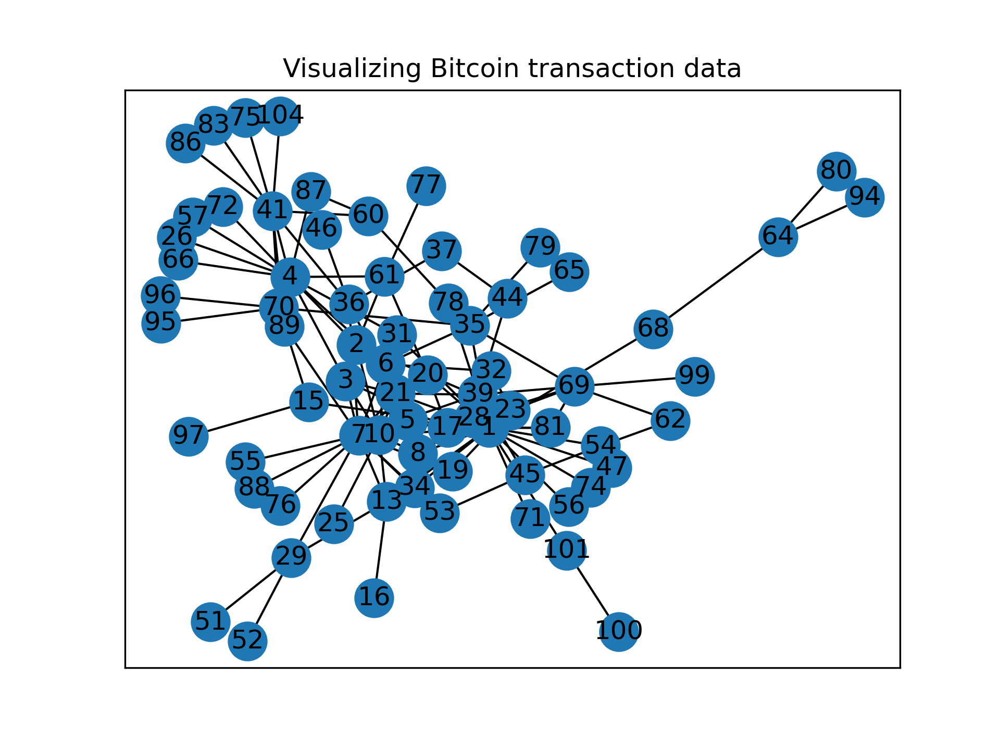

# BTC Transaction visualization
This project was intended to analyze bitcoin transaction history.

## How to run?
 - `python3 main.py`

## Sample images

## Resources:
 - [Bitcoin OTC trust weighted signed network
](https://snap.stanford.edu/data/soc-sign-bitcoin-otc.html)